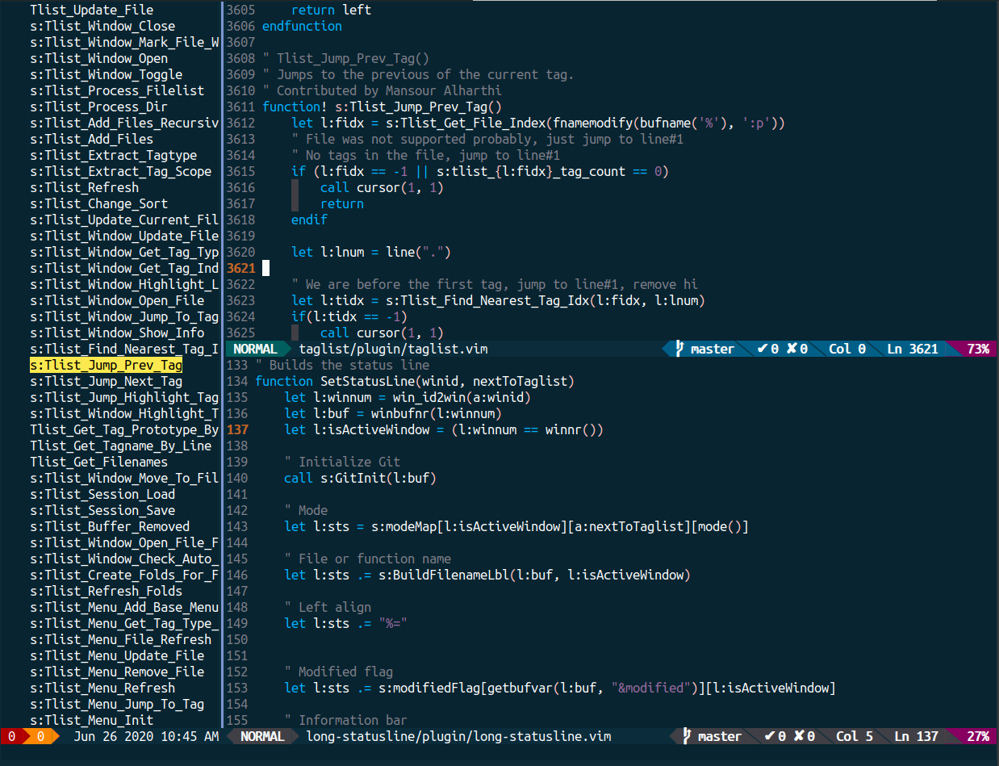

Long StatusLine
===============

## Demo

## Dependencies

* [YCM](https://github.com/ycm-core/YouCompleteMe): For errors and warnings.
* [TagList](https://github.com/yegappan/taglist): Status line spans Taglist's
  window too.
* [Asyncrun](https://github.com/skywind3000/asyncrun.vim): To get Git
  information asynchronously without a slowdown.

Use at your own risk, this is not a complete project. You can view my
[vimrc](vimrc/vimrc.vim) to see my full Vim setup and replicate in your system,
hopefully not many changes are needed.

### More
The colorscheme is in `colors/`, you just need to symlink it in vim's
`colors/` directory.
